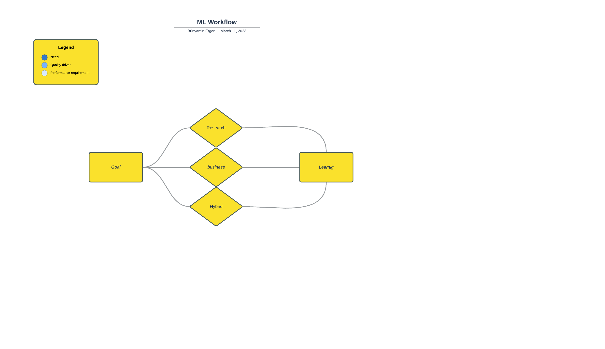

# Machine Learning Workflow Project

> “*Mathematics has always existed. Humans discovered it. Mathematics is essentially a matter of patience. It should be understood not by memorizing, but by discovering.” -* **Cahit Arf**
> 

# What is Machine Learning Workflow

The machine learning workflow is a crucial process in developing machine learning models.
I have examined various machine learning workflows and incorporated the latest updates to create a custom workflow. 
This workflow is continually being updated with new topics and information to ensure it remains relevant.

The workflow consists of seven main steps:

1. Goal
2. Learning
3. Data
4. Data Process
5. Feature Engineering 
6. Model
7. Goal Evaluation

To make the workflow easier to follow, I have created a diagram that outlines each step of the process. Additionally, I have included guiding questions to help users understand each step and ensure they are on the right track.

Finally, users can access detailed pages for each topic covered in the workflow. This enables them to delve deeper into each topic and gain a more thorough understanding of the entire process.

Overall, this machine learning workflow provides a comprehensive guide for users to develop effective machine learning models. By following this workflow, users can be confident in their ability to create accurate and efficient models.

# How to use

1. Questions:

When developing a machine learning project, it can be more beneficial and practical to use the workflow diagram or guiding questions. It can be overwhelming to dive deep into every topic all at once.

After deciding to start a machine learning project, you can move on to the guided questions section and answer each question in sequence. The guided questions section will look like this:

- What is your goal?  
\- Diabete predict  
- What is type of goal ?  
\- Research  
- What is the learning type?  
\- Supervised  
- Do you have data?  
\- No  
\- Get data or  
\- collect data  
... 
and so on. 

By answering each question in sequence, you can develop a clear understanding of the goals and needs of your project. This approach can help you stay on track and avoid becoming overwhelmed by the various topics involved in machine learning. Overall, using the workflow diagram or guided questions can make the process of developing a machine learning project more manageable and efficient.

2. Diagrams

Instead of using guiding questions, you may prefer to use a diagram to visualize the workflow. The diagram will be similar to the questions, but it presents the information in a more visual way. Diagrams can be more memorable and easier to understand because of their visual nature. Additionally, one advantage of a diagram is that it enables users to return to previous steps if necessary.

We are considering two approaches for creating a diagram: static and dynamic. The static diagram will include general headings, such as the seven main steps in the workflow. The dynamic diagram, on the other hand, will be shaped by the project or user and will include questions similar to those in the guided questions section.

Using a diagram can make it easier to understand and follow the workflow. The static diagram provides a general overview of the workflow, while the dynamic diagram can be customized to fit the needs of the specific project or user. Ultimately, the choice between the two approaches will depend on the user's preferences and the specific project's requirements.

Dynamic Workflow Diagram:

For example, after you determine your goal, when you click on the "Type of goal" option, 
the dynamic diagram will change and the next step will appear.
You can click and read the content of the step that you do not understand or do not know.
In fact, in the "How to Use" section, we advise you not to dive deep into all the topics, 
as it may cause you to lose your way. 
Instead, we recommend that you identify your project goals and follow the steps accordingly.

Örnek statik diagram:

## How to Contribute?

In this article, will discuss how you can contribute to Machine Learning Workflow project. 
We welcome your collaboration in making corrections and adding information. 
If you want to add a new page, please refer to the Architecture section for the page structure and fill it accordingly. 
If you decide to skip a heading or add a new one, please let us know the reason.
 
Contributing to a project is a great way to give back to the community and improve the quality of the project. 
Here are some ways you can contribute:
 
- **Report issues**: If you encounter any issues while using the project, please report them to us. 
This will help us identify and fix the problems.
- **Fix issues**: If you have the technical expertise, you can fix the issues yourself and submit a pull request.
- **Add new features**: If you have an idea for a new feature, you can implement it and submit a pull request.
- **Write documentation**: Good documentation is essential for any project. If you have good writing skills, 
you can contribute by writing documentation.
- **Test the project**: Testing the project and reporting any bugs or issues is a valuable contribution.
- **Spread the word**: If you believe in the project, you can help by spreading the word and encouraging others to use it.

In conclusion, contributing to a project is a great way to improve the quality of the project and give back to 
the community. We welcome your contributions and look forward to working with you.

## Architecture of Project

This section is intended to guide you on how to structure your pages when contributing to the project. 
The project is structured in a way that each page has a specific purpose and layout.
 
Under the Architecture section, you will find the recommended page structures. If you wish to add a new page, 
please ensure that it follows the structure provided. 
This will ensure that the project remains organized and easy to navigate.

- # Main Topic
  Main Topic's short brief

  - ## [Sub Topic Page](MachineLearningWorkflow/pages/SubTopicPage.md)
    - ### [Sub Topic Page](MachineLearningWorkflow/pages/SubTopicPage.md) 
      - #### [Sub Topic Page](MachineLearningWorkflow/pages/SubTopicPage.md)
        - ##### [Sub Topic Page](MachineLearningWorkflow/pages/SubTopicPage.md)
          - ###### [Sub Topic Page](MachineLearningWorkflow/pages/SubTopicPage.md)
  - ## [Sub Topic Page](MachineLearningWorkflow/pages/SubTopicPage.md)
    - ### [Sub Topic Page](MachineLearningWorkflow/pages/SubTopicPage.md)
      - #### [Sub Topic Page](MachineLearningWorkflow/pages/SubTopicPage.md)
        - ##### [Sub Topic Page](MachineLearningWorkflow/pages/SubTopicPage.md)
          - ###### [Sub Topic Page](MachineLearningWorkflow/pages/SubTopicPage.md)

## Upcoming features

- Workflow Diagram

---

# Machine Learning Workflow

# Goal

Project Purpose etc...
Questions, Problems etc.
Goal Types below...
   
  - ## [Business](goal.md)

    - [Customer Obsession](goal.md)
    - [Business Problem](MachineLearningWorkflow/pages/BusinessProblem.md)
  - ## [Research](goal.md)
    - [Research Problem](MachineLearningWorkflow/pages/ResearchProblem.md)
  - ## [Hybrid](goal.md)
    - [Page](page.md)

---

# Learning

Machine Learning Learning Types

  - ## [Supervised](page.md)
    - ### [Classification](page.md) 
    - ### [Regression](page.md)
  - ## [Semi Supervised](page.md)
    - ### [Page](page.md)
  - ## [Self Supervised](page.md)
    - ### [Page](page.md)
  - ## [Unsupervised](page.md)
    - ### [Page](page.md)
  - ## [Reinforcement](page.md)
    - ### [Page](page.md) 
  - ## [Deep Learning](page.md)
    - ### [Page](page.md) 

---

# Data
> *“If your data is not of good quality, it doesn't matter which model you use!”* **- Unknown** 
>

  - ## [Structure](page.md)
    Structure of Data ...

    - ### [Unstructured Data](page.md) 
    - ### [Semi Structured Data](page.md)
    - ### [Structured Data](page.md)

  - ## [Types](page.md)
    Types of Data ...
    - ### [Math/Statistic based](page.md)
      - #### [Qualitative(Categorical)](page.md)
        Kategorik data nedir etc...
        - ##### [Nominal](page.md) 
        - ##### [Ordinal](page.md) 
      - #### [Quantitative (Numeric)](page.md)
        Kategorik data nedir etc...
        - ##### [Discrete](page.md) 
        - ##### [Continuous](page.md) 
    - ### [Computational Data](page.md)
      - ##### [Integer](page.md)
      - ##### [Floating](page.md)
      - ##### [Boolean](page.md)
      - ##### [String](page.md)
      - ##### [Array](page.md)
      - ##### [Object](page.md)
      -  ##### [Image](page.md)
      - ##### [Sound](page.md)
      - ##### [Batch/stream/online](page.md)

    - ### Bonus
      - [Big Data](page.md)
      - [Dark Data](page.md)
      - [Small Data](page.md)

  - ## [Collection](page.md)
    Collection of Data ...
    - ### [Sampling](page.md)
    - ### [Labelling](page.md)
    - ### [Mining](page.md)
      - #### [Wrapper](page.md)
      - #### [Scraping](page.md)
      - #### [APIs](page.md)
      - #### [Crawling](page.md)
    - ### [Bias](page.md)
  
 - ## [Integration](page.md)
   - ### [Schemas](page.md)
 
 - ## [Augmentation](page.md)
   - ### [Data Augmentation](page.md)
 
 - ## [Balance](page.md) 
   Balance of Data
   - ### [Categoric](page.md)
   - ### [Numeric](page.md)
   - ### [Target](page.md)

---

# Data Process

Data Process...

  - ## [Cleaning](page.md)
    - ### [Anomalies](page.md) 
    - ### [Missing Data](page.md)
  - ## [Analysis](page.md)
    - ### [distirbutions](page.md)
    - ### [Relations ( cat and num)](page.md)
    - ### [correlations](page.md)
    - ### [variances](page.md)
    - ### [mean](page.md) 
    - ### [std](page.md)
    - ### [group](page.md) 

---

# Feature Engineering

> “*Feature engineering is the art of extracting useful patterns from data. .” -* **Unknown**
>

Feature Engineering ...

  - ## [Intuition](page.md)
    - ### [Tips](page.md) 
  - ## [Analyses](page.md)
    - ### [ANOVA ( Analys of Variance)](page.md)
  - ## [Tests](page.md)
  - ## [Transformations](page.md)
    - ### [Normalization](page.md)
    - ### [Standardization](page.md) 
    - ### [Scaling](page.md)
      - #### [Standard Scale](page.md)
      - #### [MinMax Scale](page.md)
      - #### [Power Transform](page.md)
      - #### [MinAbs](page.md)
      - #### [Robust](page.md)
    - ### [Logarithmic Transformation](page.md)
    - ### [Binning](page.md)
    - ### [Encoding](page.md) 
    - ### [Interaction terms](page.md) 
    - ### [Polynomial expansion](page.md) 
    - ### [Box - Cox](page.md) 
    - ### [Hybrid](page.md) 
    - ### [Radial Basis Function](page.md) 
    - ### [Quadratic Features](page.md) 
  - ## [Generating](page.md)
    - ### [Multiplying](page.md) 
      - #### [Variable to Variable](page.md)
        - ##### [Quantitive2Qualitative](page.md)
        - ##### [Quantitive2Qualitative](page.md)
    - ### [Combining](page.md) 
      - #### [Product / Ratio](page.md)
      - #### [Price-Earnings Ratio (P/E ratio)](page.md)
      - #### [Variable to Variable](page.md)
        - ##### [Quantitive2Qualitative](page.md)
        - ##### [Quantitive2Qualitative](page.md)
    - ### [Aggregation](page.md) 
  - ## [Interaction ](https://christophm.github.io/interpretable-ml-book/interaction.html) 
  - ## [Filtering](page.md) 
    - ### [Tree path features](page.md)
    - ### [Image based filtering](page.md)
    Color filtering etc
    - ### [Sound based filtering](page.md)
    frequency / wave
  - ## [Text Based Featured](page.md) 

  - ## Bonus
    - [Survival bias](https://en.wikipedia.org/wiki/Survivorship_bias)
---

# Model
[Model](page.md) 
  - ## [Development](page.md)
    - ### [Algorithm Selection](page.md)
      - #### [Rule Based Method](page.md)
      - #### [Expert Knowledge](page.md)
      - #### [Empirical Evaluation](page.md)
      - #### [Meta Learning](page.md)
    - ### [Training](page.md) 
      - #### [Feature Selection](page.md)
        - ##### [Filter method](page.md)
          - ##### [Chi-Squared Test ](page.md)
      - #### [Data Parallelism](page.md)
      - #### [Model Parallelism](page.md)
      - #### [Validation](page.md)
        - ##### [Shuffling](page.md)
        - ##### [Holdout](page.md)
        - ##### [K-fold cross-validation](page.md)
        - ##### [Leave-one-out cross-validation](page.md)
        - ##### [Bootstrap Aggregating and Averaging (bagging)](page.md)
        - ##### [Time series cross-validation](page.md)
      - #### [Propagation](page.md)
        - ##### [Forward Propagation ](page.md)
        - ##### [Backward Propagation](page.md)
          gradient descent
          Adam (learning rate guncelleme, low memory)
    - ### [Optimization](page.md)
      - #### [Tuning](page.md)
        - ##### [Parameter Tuning](page.md)
      - #### [Structure](page.md)
        - ##### [Ensemble Methods](page.md)
        - ##### [Layers](page.md)
        - ##### [Activation Funtions](page.md)
        - ##### [Transfer learning](page.md)
    - ### [Evaluation](page.md) 
      - #### [Overfitting and Underfitting](page.md)
      - #### [Bias - Variance Tradeoff](page.md)
      - #### [Loss Function](page.md)
      - #### [Activation Function](page.md)
      - #### [Regularization](page.md)
      - #### [Learning Parameter](page.md)
      - #### [Error Analysis](page.md)
      - #### [Leakage](page.md)
      - #### [Explainability](page.md)
    - ### [Pipeline](page.md) 
    - ### [Persistence](page.md)
  - ## [Deployment](page.md)
    - ### [Production environments](page.md) 
      - #### [Serving](page.md)
    - ### [Containerization and orchestration](page.md) 
    - ### [Auto-scaling and A/B testing](page.md) 
  - ## [Maintenance](page.md)
    - ### [Monitoring](page.md) 
      Continuously evaluating the model's performance and accuracy in production to understand how it is performing and identify any issues that may arise.
      - #### [Drift](page.md)
        - ##### [Data Drift](page.md)
        - ##### [Model Drift](page.md)
        - ##### [Drift detection](page.md)

    - ### [Updating](page.md) 
      Keeping the model's data and algorithms up to date with the latest research and best practices. Scaling model over time according to the needs
    - ### [Versioning](page.md) 
    - ### [Logging](page.md) 
    - ### [Security and Privacy](page.md) 
      - #### [Adversarial Attacks](MachineLearningWorkflow/pages/AdversarialAttacks.md)

---

# Goal Evaluation
[Customer Obsession](page.md)

---
___
***

# Bonuses

## Bonus : Other ML Workflow Methods

  ### - [CRISP-DM](https://www.notion.so/CRISP-DM-35aea803b058486896b2ff63ea2124d4)

[Harvard](https://www.notion.so/Harvard-6357271060eb4773a17847b3f0e81b1f)

[OSEMN Sciforce’s ](https://www.notion.so/OSEMN-Sciforce-s-43c8e6fd66a14379879650690aeea6da)

[AWS Sagemaker](https://www.notion.so/AWS-Sagemaker-84a80aff2c3b43a0be3f07ab7a8d3f8e)

## Bonus : Other Approaches

[Statistical Analysis Plan (SAP)](https://www.notion.so/Statistical-Analysis-Plan-SAP-4a6eef7c796c4414af64264c64218055)

[Data Analyses Plan](https://www.notion.so/Data-Analyses-Plan-a3fae70289db41f2a6ae77ba9b39900c)

## Bonus : White Paper

[White Paper](https://www.notion.so/White-Paper-b9a20c4ea57744238eb7917498bcb57f)

## Bonus : Podcast - Data Scientist vs Machine Learning Engineer

[https://open.spotify.com/episode/26iG67nH0vHKYczROEh5oq?si=e712ea3bd9be4b81](https://open.spotify.com/episode/26iG67nH0vHKYczROEh5oq?si=e712ea3bd9be4b81)

## Bonus : Auto ML

[Auto ML](https://www.notion.so/Auto-ML-32fee2d9fd1c4f64ba6b7546c5ec58a2)

## Bonus : Tuckman Model

## Bonus : Agile

